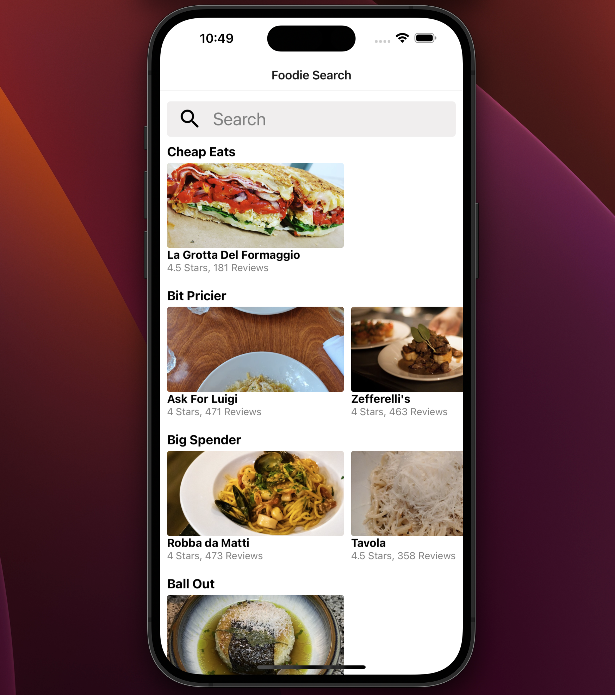

# React Native Application

  

Application was created using [Expo](https://expo.io/).

## Inspiration

This was my first introduction to React Native. I wanted to create a simple application that would allow me to learn the basics of React Native and Expo.

I chose to use Expo because of its simplicity and is quick to get started with.

The projects main focus was to learn the basics of React Native and Expo. This includes:

- Creating a new project
- Using Expo to run the application
- Using common react native components
  - `View`
  - `Text`
  - `Image`
  - `StyleSheet`
  - `Button`
  - `TouchableOpacity`
  - `ScrollView`
  - `FlatList`
  - `TextInput`

Styling was not the main focus of this project. I used the `StyleSheet` component to style the application but I did not use any of the more advanced styling techniques. Reason being is that I wanted to focus on the basics of React Native and Expo, not spend hours on styling.

## Learnings

I've used React to create numerous web applications, but this was my first introduction to React Native. I found that the concepts are very similar to React, but there are some differences.

I found that the documentation for React Native was very good, making it easy to learn the basics of React Native. I was a bit surprised by the limited number of core components that are available in React Native. That being said, I was still able to create a simple application that I was happy with.

I was happy to learn that I could use all the same tools that I use for React to create React Native applications. To manage global state I used the `useContext` hook and `createContext` function. I used axios to make API calls and `react-native-vector-icons` to add icons to the application. 

Navigation was a bit of a strange concept to understand. It's not as simple as using a router in React. It was a bit confusing to figure navigating a user to a specific restaurants details page. I learnt about the various props that are available to the `Stack.Navigator` component. I also learnt about the `navigation.navigate` function and how to pass data to the next screen. I used the `withNavigation` HOC to pass the `navigation` prop to the `RestaurantDetails` component.

I'm so used to using `map` to loop through an array of data and return JSX. I found that React Native uses the `FlatList` component to loop through an array of data and return JSX. Once I figured out how to use the `renderItem` prop, I was able to create a lists quite easily.

## Future Improvements

The app needs some help with styling. I would like to add some more advanced styling techniques to the application and add a `MapView` component to the application to show the location of the restaurant on a map. This data is already available in the API response.

  

